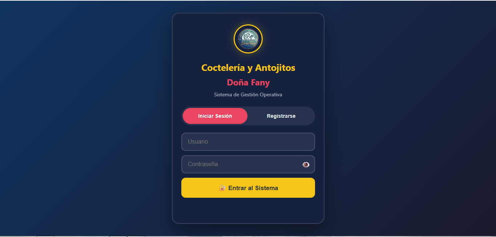
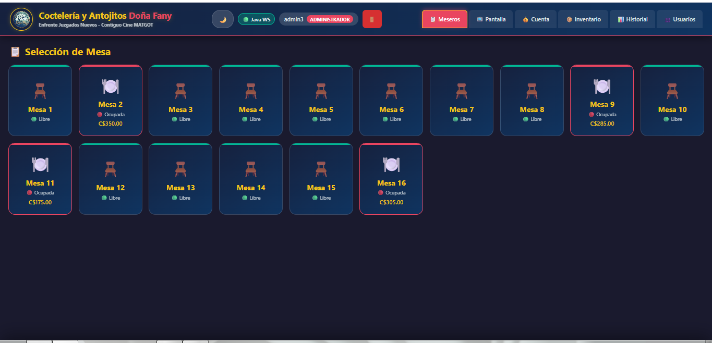
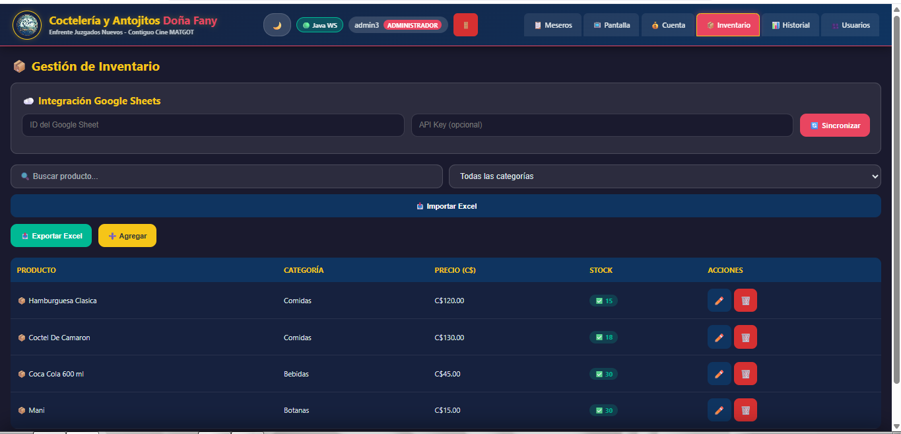
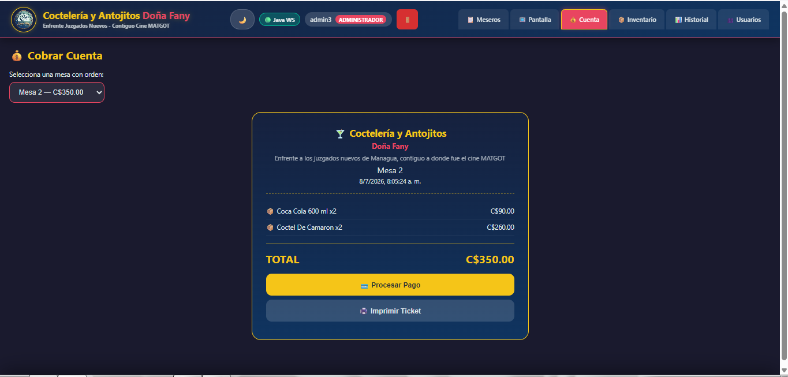
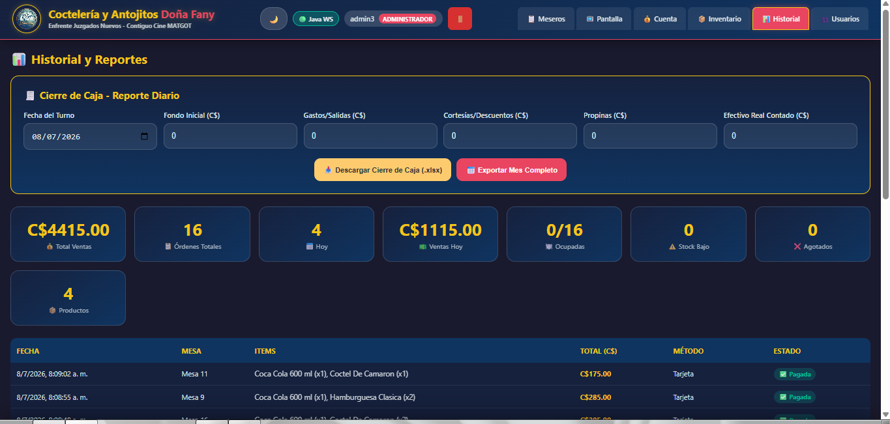
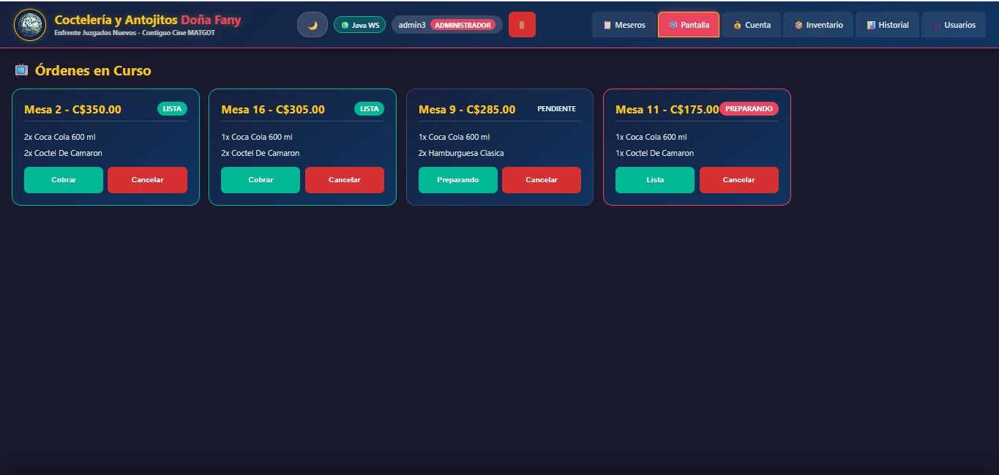
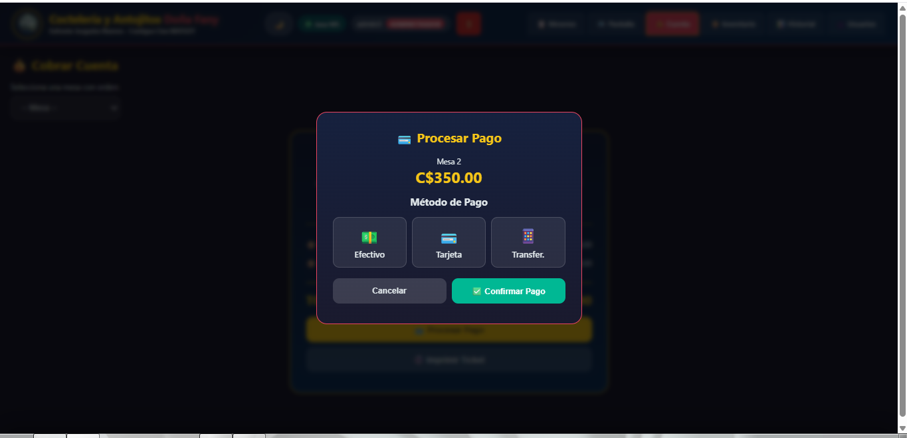

# 🍹 POS System

> Sistema de Punto de Venta (POS) desarrollado con **Java** y **Spring Boot** para la administración de pequeños negocios.

---

## 📌 Descripción

Este proyecto fue desarrollado para un **negocio real**, con el objetivo de facilitar la administración diaria de ventas, productos, inventario y clientes.

El sistema permite automatizar procesos que anteriormente se realizaban de forma manual, mejorando el control y la organización del negocio.

---

## 🎯 Objetivo del proyecto

Este sistema fue desarrollado para un negocio real con el objetivo de optimizar la administración de ventas, productos e inventario, reduciendo procesos manuales y mejorando la organización del negocio.

---

## ✨ Estado del proyecto

🟢 Proyecto funcional

Actualmente el sistema se encuentra en funcionamiento y continúa recibiendo mejoras y nuevas funcionalidades.

---

## 🚀 Funcionalidades

- 🔐 Inicio de sesión de usuarios
- 📦 Gestión de productos
- 🛒 Registro de ventas
- 👥 Gestión de clientes
- 📊 Control de inventario
- 🧾 Generación de facturas
- 📈 Reportes de ventas

---

## 🛠️ Tecnologías utilizadas

### Backend
- Java
- Spring Boot
- Spring Data JPA
- Hibernate

### Frontend
- HTML5
- CSS3
- JavaScript

### Base de datos
- MySQL

---

## 📷 Capturas del sistema

### Inicio de sesión

### Panel principal

### Gestión de productos

### Facturas

### Cierre de caja

### Cuenta

### Pagos

---

## ⚙️ Instalación

1. Clonar el repositorio.
2. Configurar la base de datos.
3. Configurar el archivo `application.properties`.
4. Ejecutar la aplicación.

---

## 👨‍💻 Autor

**Ramsés Baltodano**

Backend Developer

Java • Spring Boot • Web Development